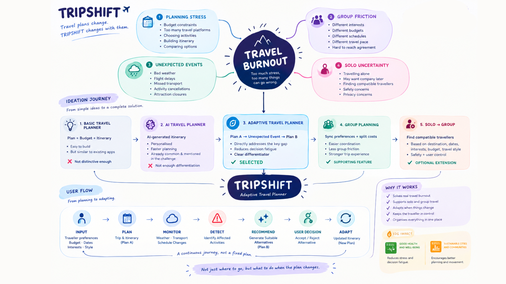
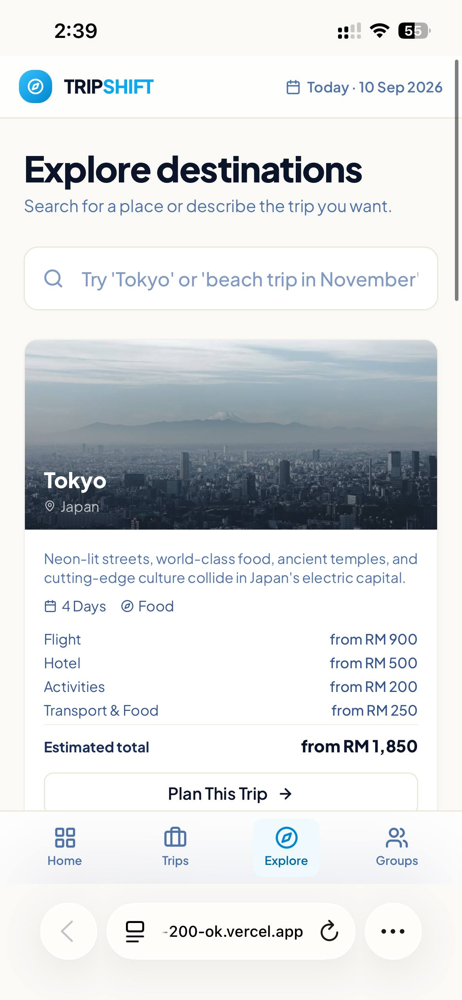
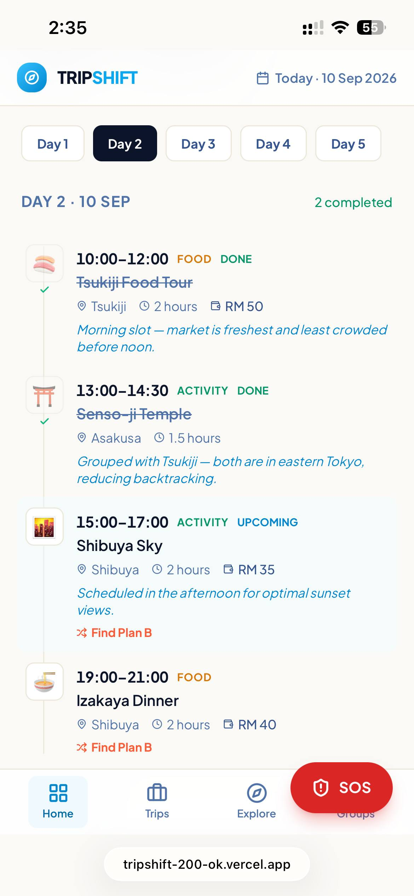

# TRIPSHIFT by 200Ok

**Team:** Tan Xiao Shih, Then Pei Joo, Teh Kai Wen

**Problem Statement:** Travel Planner

**Video Presentation:** https://youtu.be/rCYqyMUVAhw?si=LY_K5sZWG_MsoTbB

**Presentation Slides:** https://canva.link/5bupkqqmu0ahkj9

---

# 1. Project Overview

Planning a trip is exciting, but travelling rarely goes exactly according to plan. Unexpected events, different preferences and last-minute changes can lead to stress, decision fatigue and travel burnout.

**Our Solution:** TRIPSHIFT is an adaptive travel planner that helps travellers recover when their original plan no longer works.

Instead of treating an itinerary as a fixed schedule, TRIPSHIFT treats each activity as a **flexible block** that can be rearranged, grouped and replaced when circumstances change.

### Features

- **Smart Trip Planning** — Builds a connected itinerary based on destination, dates, budget, interests, available time and travel preferences.
- **Block-Based Itinerary** — Each trip is organised into days and flexible blocks such as activities, food, transport and stays. Users can reorder blocks, group related activities together and pin important blocks to Trip Info.
- **Adaptive Itinerary (Plan A → Plan B)** — When an activity is affected by weather, timing, budget or preference conflicts, TRIPSHIFT identifies the affected block and recommends an alternative that fits the traveller's constraints. The traveller remains in control and can accept or reject the change.
- **Group Preference Sync** — Travellers can join a trip through an invitation link and provide their own preferences. TRIPSHIFT combines these preferences to help the group build an itinerary that works for everyone.
- **Solo-to-Group Discovery** — Solo travellers can optionally discover compatible travellers or activities based on shared interests, destination and timing, with user consent and privacy-conscious location sharing.

---

# 2. Ideation & Process

## 2.1 Ideas We Considered

Our ideation started from the broader problem of travel stress and explored different ways to improve the travel-planning experience. We gradually narrowed the concept by asking which problem was least well addressed by existing travel platforms such as Agoda and Trip.com.

| Idea | Direction | Decision & Reasoning |
|---|---|---|
| **A — Basic Travel Planner** | Trip creation, budget, itinerary and activities | **Dropped as the core concept.** Useful but too similar to existing travel-planning products. It solved planning before the trip but not what happens when plans change. |
| **B — All-in-one AI Travel Planner** | AI-generated itinerary, personalised recommendations, flights, hotels and budget | **Dropped as the core concept.** AI itinerary generation is already common and is also mentioned as an example in the challenge brief. We kept AI as an enabling technology rather than our main differentiator. |
| **C — Adaptive Travel Planner** | Plan A → unexpected event → Plan B | **Selected as the core concept.** It directly addresses the gap after an itinerary has already been created. Instead of forcing travellers to manually rebuild their schedule, TRIPSHIFT adapts the affected part of the trip. |
| **D — Group Travel Planning** | Invite travellers, collect preferences and combine them | **Kept as a supporting feature.** Group trips create additional friction because travellers have different interests, budgets and schedules. |
| **E — Solo → Group Matching** | Help solo travellers find compatible people or activities during a trip | **Kept as an extension.** This expands the idea of adapting to real travel situations beyond itinerary changes, while introducing safety, privacy and consent requirements. |

### Final Direction

These explorations led to the final concept:

> **TRIPSHIFT = Smart Planning + Flexible Blocks + Group Preferences + Adaptive Re-planning**

The core differentiator is not simply generating a good itinerary. It is helping travellers **continue their trip when the original plan stops working.**

---

## 2.2 Ideation Boards

---

## 2.3 Mentor Consultation

**Date:** 8/9/2026

**Mentor:** Teng Wei Herr

| Feedback Received | What Was Changed |
|---|---|
| Allow users to enter their own travel preferences instead of only selecting from predefined choices. | Updated the preference feature to allow users to enter their own preferences. This gives users more flexibility to describe specific interests and requirements that may not be available in the predefined options. |
| Conduct research on existing travel planner applications (Itini app, Indie travel) to better understand their features and identify opportunities for differentiation. | Conducted competitor research on existing travel planner apps and identified common features and gaps, particularly in personalized planning, group coordination, and adaptive re-planning. |
| For forming travel groups, allow users to invite others through a link and combine their preferences when planning the trip. | Added an invitation-link concept that allows the trip creator to share a link with other travellers. After joining, members can provide their preferences, which are combined to support group itinerary planning. |
| The idea is good, but the "wow" moment was not clearly shown. | Strengthened the adaptive itinerary flow so the disruption → alternative → updated itinerary interaction becomes the main product moment. |

---

# 3. Design & Prototype

**UI Prototype:** https://tripshift-200-ok.vercel.app/

## Explore

- Browse destinations.
- View destination information and activities.
- Discover potential places to visit.

---

## Activity details

- Transportation.
- Activity costing.

---

## Block-Based Itinerary

- View activities in a timeline.
- Organise activities into flexible blocks.
- Edit and reorder blocks.
- Access trip information and itinerary.

---

## Group Planning

- Invite travellers.
- Collect traveller preferences.
- Combine preferences for the group.

<!-- Add your Group Planning image here -->

---

## Adaptive Plan B

- Simulate an unexpected disruption.
- Identify the affected itinerary block.
- Compare alternative activities.
- Consider time, budget, location and preferences.

<!-- Add your Adaptive Plan B image here -->

---

## Updated Itinerary

- Replace only the affected block.
- Keep the remaining itinerary unchanged.
- Allow the traveller to continue with the updated plan.
- Search for nearby activities

<!-- Add your Updated Itinerary image here -->

---

## Nearby Now / Solo Connect

- Discover nearby activities or events.
- Allow solo travellers to discover compatible travellers or groups.

---

# 4. What Makes It Different

TRIPSHIFT is not designed to replace existing flight booking, hotel booking or travel discovery platforms.

Instead, it focuses on the **adaptation gap** — what happens after a traveller's original itinerary no longer works.

## Competitor Comparison

| Capability | Trip.com | Wanderlog | Roadtrippers | Couchsurfing | **TRIPSHIFT** |
|---|:---:|:---:|:---:|:---:|:---:|
| Trip / itinerary planning | ✓ | ✓ | ✓ | — | **✓** |
| Flight / hotel planning | ✓ | ✓ | — | — | **✓** |
| AI-assisted planning | ✓ | ✓ | ✓ | — | △ |
| Itinerary editing / reordering | ✓ | ✓ | ✓ | — | **✓** |
| Group collaboration | △ | ✓ | ✓ | △ | **✓** |
| Traveller preferences | △ | △ | △ | ✓ | **✓** |
| Combined group preferences | △ | △ | △ | — | **✓** |
| Flexible itinerary blocks | — | — | — | — | **✓** |
| Move related blocks together | — | — | — | — | **✓** |
| Identify affected itinerary block | — | — | △ | — | **✓** |
| Recommend an alternative after disruption | △ | △ | △ | — | **✓ Core Feature** |
| Consider time + budget + location + preferences | △ | △ | △ | — | **✓** |
| Replace only the affected block | △ | △ | △ | — | **✓** |
| Nearby / spontaneous discovery | — | — | — | ✓ | **✓** |
| Solo-to-group discovery | — | — | — | ✓ | **✓ Extension** |

### Legend

- **✓** = meaningful capability
- **△** = related functionality exists, but it is not the main focus
- **—** = not a core capability

---

## Our Differentiation

Existing travel platforms already provide strong individual capabilities such as booking, itinerary management, collaboration, route planning and social discovery.

TRIPSHIFT combines these ideas around one central experience:

> **An itinerary that can adapt when reality changes.**

The key differentiators are:

### 1. Flexible Itinerary Blocks

Instead of treating the itinerary as one fixed schedule, TRIPSHIFT breaks the trip into manageable blocks.

This allows one part of the trip to change without rebuilding everything.

### 2. Adaptive Plan B

When something unexpected happens, TRIPSHIFT focuses on the affected block instead of generating an entirely new trip.

> **Plan A → Disruption → Affected Block → Alternative → Updated Plan**

### 3. Group-Aware Adaptation

Alternative activities can be evaluated against combined traveller preferences, making the replacement more suitable for the whole group.

### 4. Traveller Control

TRIPSHIFT does not automatically force a change.

The traveller can:

- Accept the alternative
- Keep the original plan
- Replace the affected block
- Edit the itinerary
- Undo the replacement

This keeps the traveller in control.

### Key Differentiation Statement

> **Other travel planners help create Plan A. TRIPSHIFT helps travellers recover when Plan A breaks.**

---

# 5. Technical Architecture & Feasibility

## Tech Stack

### Frontend: Built

#### 1. React 18 + TypeScript

TRIPSHIFT is a component-based, multi-screen React application. TypeScript defines the shared shapes for trips, itinerary activities, travellers, groups, disruptions, alternatives, flight offers, and hotel options. This makes the travel flow safer to extend as the app moves from mock data to saved user data.

#### 2. Vite

Vite provides fast local development and production builds. It suits a hackathon prototype because the team can make and test interface changes quickly.

#### 3. Tailwind CSS

Tailwind CSS keeps spacing, colour, responsive behaviour, and repeated interface patterns consistent without a large custom stylesheet.

#### 4. Framer Motion

Framer Motion supports the transitions between planning, itinerary, disruption, and Plan B states. This helps the multi-screen prototype feel connected while travellers move through the flow.

#### 5. Lucide React

Lucide React provides a lightweight, consistent icon set for travel, weather, group, and action controls.

---

## Data: Current Prototype

The final prototype uses **structured mock data rather than a backend**.

It models:

- Destinations
- Flights
- Hotels
- Trips
- Dates
- Itinerary blocks
- Budgets
- Weather forecasts
- Disruptions
- Alternatives
- Travellers
- Group preferences
- Solo Connect matches

This supports a complete end-to-end demonstration without claiming that flight prices, weather, or bookings are live.

---

# Build Plan & Scope

## Data, APIs, and Services: Planned Build Phase

### 1. Supabase PostgreSQL + Authentication

Supabase will store:

- Accounts
- Trips
- Group membership
- Invitation links
- Preferences
- Itinerary blocks
- Saved Plan B changes

Its free tier gives the team a managed PostgreSQL database, authentication, and row-level access controls without building a custom backend from scratch.

The trade-off is that secure handling of external providers still requires server-side functions.

---

### 2. Gemini API

Gemini will support the adaptive recommendation layer.

It will receive a limited, structured trip context, such as:

- The affected activity
- Weather
- Time
- Budget
- Location
- Group preferences

It will then explain suitable Plan B options in plain language.

Gemini will **not** make a change automatically.

The traveller still selects:

> **Apply Plan B**

or

> **Keep Plan A**

---

### 3. Google Maps Platform

Google Maps Platform will provide:

- Place search
- Map context
- Route distance
- Travel time
- Nearby activity discovery

This gives the Plan B flow location-aware evidence instead of relying only on a text recommendation.

---

### 4. Live Weather API

Weather is the first planned live integration because it directly supports the core Plan B feature.

A server-side function will request and normalise forecast data while keeping provider keys out of the browser.

---

### 5. Travel Provider APIs

Flight, hotel, places, and transport data will come after the core Plan B workflow is persistent and tested.

Server-side functions will act as a proxy for:

- API keys
- Rate limits
- Provider-specific formats
- Caching

These providers may require commercial API access, so they are not part of the first minimum build.

---

### 6. GitHub + Vercel

GitHub will manage source control and pull requests.

Vercel will build and deploy the React frontend on each approved push, keeping deployment simple for a small team.

---

# Constraints and Scope

The current flight, hotel, weather, and matching data are **representative prototype data**.

Live travel services can introduce:

- API keys
- Commercial terms
- Rate limits
- Reliability constraints

The first **three-week build** will focus on:

- Saved trips and groups
- Live weather
- The Plan B decision flow

The following are outside this initial scope:

- Automatic booking
- Payments
- Exact location sharing
- Broad provider integrations
